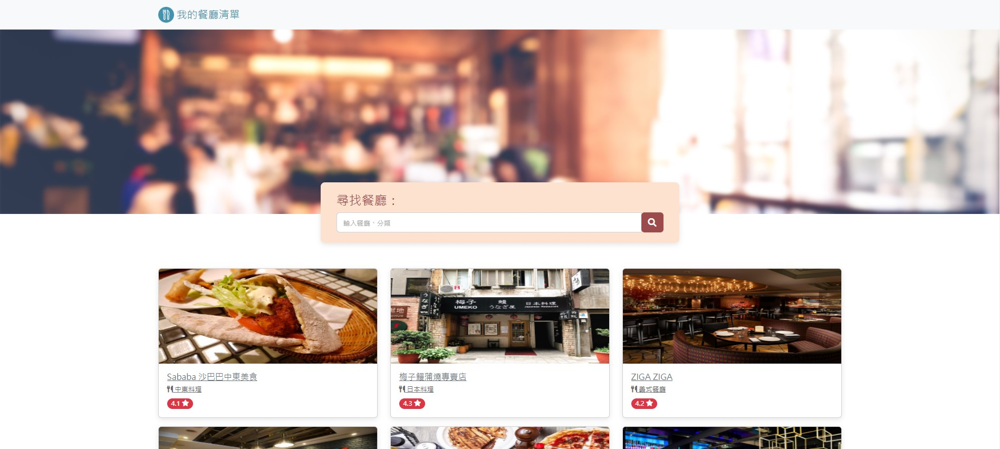

# 我的餐廳清單
## 紀錄精選餐廳的清單，可以瀏覽、查看餐廳資訊，並透過關鍵字進行搜尋

## 功能
- 瀏覽所有餐廳
- 點擊餐廳查看詳細資訊
- 透過關鍵字搜尋餐廳

## 開始使用
<以下皆在終端機中操作>
1. 確認已安裝 node.js 與 npm
2. 輸入以下，將此專案 clone 到自己的電腦 
   ```
   git clone https://github.com/NatsuTW/restaurant_list.git
   ```
3. 進入存放此專案的資料夾，輸入以下安裝 npm 套件
   ```
   npm install
   ```
4. 輸入以下執行專案
   ```
   npm run start 
   ```
5. 若看見此訊息，代表順利進行，可打開瀏覽器輸入以下網址瀏覽
   ```
   Listening on http://localhost.3000
   ```
6. 若欲暫停使用
   ```
   ctrl + c
   ```
## 開發工具
- Node.js 14.16.0
- Express 4.16.4
- Express-Handlebars 3.0.0
- Bootstrap 5.1.3
- Font-awesome 6.1.1
